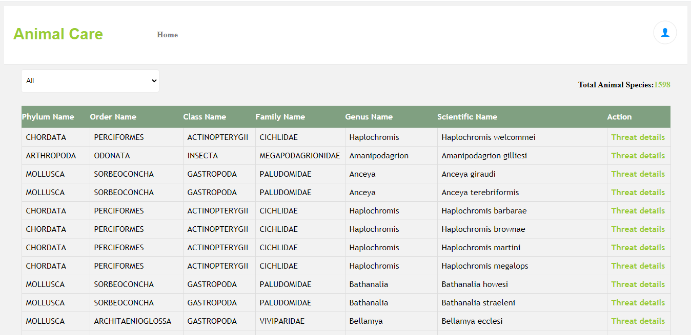
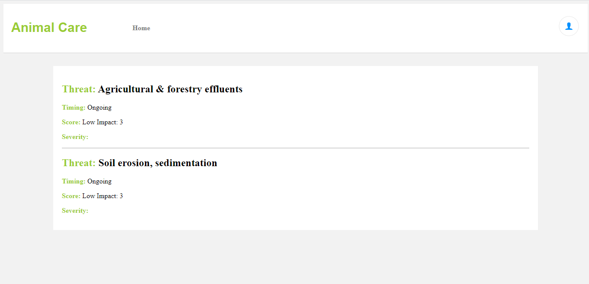

# ANIMAL CARE APP

## Description

Animal Care is an app that shows a list of all animal species in the East African region and their total count. It also allows access to the details of the threats for extiction of each animal species.

## FEATURES

- View all animal species
- Filter species by phylum name
- View each species details about threats of extinction

## Home Page


## Details Page


## Built With

- React-Redux

## Live Demo

[Live Demo Link](https://animal-care-app.herokuapp.com/)

## Getting Started

To get a local copy up and running follow these simple example steps.

### Prerequisites

- Node.js
- React
- React-DOM
- React-Create-App
- Redux
- npm
- CSS
- ES6

## Instructions

- git clone https://github.com/frankopkusianwar/Animal-Care-REACT.git
- npm install
- npm start

### Usage

- Type ```http://localhost:3000/``` in the browser tab.
- Now you can use the app.


### Test

- To run tests `bundle excec rspec`

## Author

- Okiror Frank

👤 **Okiror Frank**

- Github: [@frankopkusianwar](https://github.com/frankopkusianwar)
- Twitter: [@franko0781](https://twitter.com/franko0781)
- Linkedin: [Okiror Frank](https://linkedin.com/in/frank-okiror)
- Email: okirorfrank3@gmail.com

## 🤝 Contributing

Contributions, issues and feature requests are welcome!

Feel free to check the [issues page](issues/).

## Show your support

Give a ⭐️ if you like this project!

## Acknowledgments

- Microverse, standup team and the microverse community for helping build the skills that were used on this project
